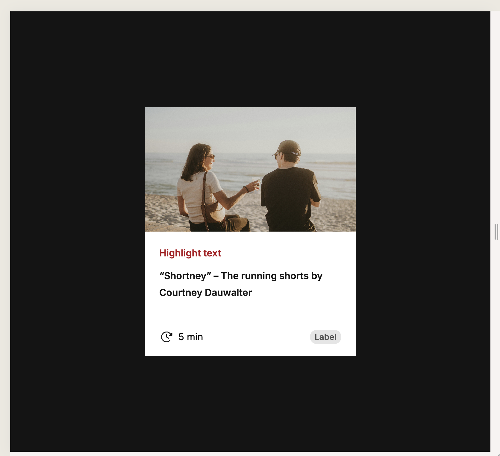

# Quick Start

## Installation :
1. Install
```bash
npm i
```

3. Start server
```bash
npm run dev
```

4. Start test
```bash
npm run test
```

# Features
- Create a componennt from Figma 
- Add test
- Using cva

# Explains
- The Chip component could be a separate component, if it is reused.
- Same for the reading time component
- Font Inter in figma does not have the same display as google font Inter.

# Screenshoots

